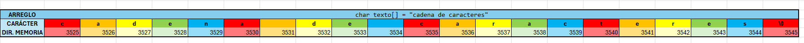

# Funciones <string.h>

1. strlen
¿Para qué sirve la función? strlen sirve para obtener la longitud de una cadena de caracteres (es decir, contar cuántos caracteres contiene, excluyendo el carácter nulo '\0' al final).

Prototipo de la función:

```c
size_t strlen(const char *str);
```
Parámetros:

str: Un puntero a la cadena de caracteres cuyo tamaño se desea conocer.

Ejemplo:

```c
#include <stdio.h>
#include <string.h>

int main() {
    char texto[] = "Hola Mundo";
    printf("La longitud de la cadena es: %zu\n", strlen(texto));
    return 0;
}
```
Salida:
La longitud de la cadena es: 10

2. strcpy
¿Para qué sirve la función? strcpy se utiliza para  una cadena de caracteres (incluido el carácter nulo) de un lugar a otro.

Prototipo de la función:

```c


char *strcpy(char *destino, const char *origen);
```

Parámetros:

destino: Un puntero a la cadena de destino, donde se á el contenido de la cadena origen.

origen: La cadena que será copiada a destino.

Ejemplo:

```c
#include <stdio.h>
#include <string.h>

int main() {
    char origen[] = "Hola Mundo";
    char destino[50];
    
    strcpy(destino, origen);
    
    printf("Cadena copiada: %s\n", destino);
    return 0;
}

```
Salida:
Cadena copiada: Hola Mundo

3. strncpy
¿Para qué sirve la función? strncpy copia un número específico de caracteres de una cadena de origen a una cadena de destino.

Prototipo de la función:

```c
char *strncpy(char *destino, const char *origen, size_t num);


```

Parámetros:

destino: Un puntero a la cadena de destino.

origen: La cadena de caracteres que será copiada.

num: El número máximo de caracteres que se án.

Ejemplo:

```c

#include <stdio.h>
#include <string.h>

int main() {
    char origen[] = "Hola Mundo";
    char destino[6];
    
    strncpy(destino, origen, 5);
    destino[5] = '\0';  // Asegurarse de que el destino está correctamente terminado en '\0'
    
    printf("Cadena copiada: %s\n", destino);
    return 0;
}
```
Salida:
Cadena copiada: Hola

4. strcat
¿Para qué sirve la función? strcat concatena (une) dos cadenas de caracteres.

Prototipo de la función:

```c
char *strcat(char *destino, const char *origen);
```
Parámetros:

destino: La cadena a la que se le concatenará el contenido de la cadena origen.

origen: La cadena que será añadida a la cadena destino.

Ejemplo:

```c


#include <stdio.h>
#include <string.h>

int main() {
    char destino[50] = "Hola";
    char origen[] = " Mundo";
    
    strcat(destino, origen);
    
    printf("Cadena concatenada: %s\n", destino);
    return 0;
}
```
Salida:
Cadena concatenada: Hola Mundo

5. strncat
¿Para qué sirve la función? strncat concatena un número específico de caracteres de una cadena a otra.

Prototipo de la función:

```c


char *strncat(char *destino, const char *origen, size_t num);
```

Parámetros:

destino: La cadena a la que se le agregará el contenido de la cadena origen.

origen: La cadena de caracteres que será añadida a la cadena destino.

num: El número máximo de caracteres que se añadirán.

Ejemplo:

```c


#include <stdio.h>
#include <string.h>

int main() {
    char destino[50] = "Hola";
    char origen[] = " Mundo";
    
    strncat(destino, origen, 3);
    
    printf("Cadena concatenada: %s\n", destino);
    return 0;
}
```
Salida:
Cadena concatenada: Hola Mun

6. strcmp
¿Para qué sirve la función? strcmp compara dos cadenas de caracteres lexicográficamente.

Prototipo de la función:

```c


int strcmp(const char *str1, const char *str2);
```
Parámetros:

str1: La primera cadena a comparar.

str2: La segunda cadena a comparar.

Ejemplo:

```c


#include <stdio.h>
#include <string.h>

int main() {
    char str1[] = "Hola";
    char str2[] = "Mundo";
    
    int resultado = strcmp(str1, str2);
    printf("Resultado de la comparación: %d\n", resultado);
    
    return 0;
}
```
Salida:
Resultado de la comparación: -1 (porque "Hola" es lexicográficamente menor que "Mundo")

7. strncmp
¿Para qué sirve la función? strncmp compara una cantidad específica de caracteres de dos cadenas.

Prototipo de la función:

```c


int strncmp(const char *str1, const char *str2, size_t num);

```
Parámetros:

str1: La primera cadena a comparar.

str2: La segunda cadena a comparar.

num: El número de caracteres a comparar.

Ejemplo:

```c


#include <stdio.h>
#include <string.h>

int main() {
    char str1[] = "Hola Mundo";
    char str2[] = "Hola";
    
    int resultado = strncmp(str1, str2, 4);
    printf("Resultado de la comparación: %d\n", resultado);
    
    return 0;
}

```
Salida:
Resultado de la comparación: 0 (porque las primeras 4 letras son iguales)

8. strchr
¿Para qué sirve la función? strchr busca la primera aparición de un carácter en una cadena.

Prototipo de la función:

```c


char *strchr(const char *str, int c);
```
Parámetros:

str: La cadena en la que se buscará el carácter.

c: El carácter que se quiere buscar en la cadena.

Ejemplo:

```c


#include <stdio.h>
#include <string.h>

int main() {
    char str[] = "Hola Mundo";
    char *resultado = strchr(str, 'M');
    if (resultado != NULL) {
        printf("Encontrado en la posición: %ld\n", resultado - str);
    } else {
        printf("Carácter no encontrado\n");
    }

    return 0;
}
```

Salida:
Encontrado en la posición: 5

9. strstr
¿Para qué sirve la función? strstr busca la primera aparición de una subcadena en una cadena principal.

Prototipo de la función:

```c


char *strstr(const char *haystack, const char *needle);
```

Parámetros:

haystack: La cadena principal en la que se buscará la subcadena.

needle: La subcadena que se busca dentro de haystack.

Ejemplo:

```c


#include <stdio.h>
#include <string.h>

int main() {
    char str[] = "Hola Mundo";
    char *resultado = strstr(str, "Mundo");
    if (resultado != NULL) {
        printf("Subcadena encontrada: %s\n", resultado);
    } else {
        printf("Subcadena no encontrada\n");
    }
    return 0;

}

```
Salida:
Subcadena encontrada: Mundo

10. strtok
¿Para qué sirve la función? strtok se usa para dividir una cadena en tokens, separados por delimitadores.

Prototipo de la función:

```c


char *strtok(char *str, const char *delimiters);
```
Parámetros:

str: La cadena a dividir en tokens.

delimiters: Una cadena que contiene los delimitadores.

Ejemplo:

```c


#include <stdio.h>


#include <string.h>

int main() { char str[] = "Hola,Mundo;Adios Mundo"; char *token = strtok(str, ",;");


  while (token != NULL) {
      printf("Token: %s\n", token);
      token = strtok(NULL, ",;");
  }
  return 0;
}

```


**Salida**:  
Token: Hola Token: Mundo Token: Adios Mundo


```c
"tipo de dato (int, float, etc)" n = sizeof(arreglo) / sizeof(arreglo[0]);
```

En la cual obtenemos el tamaño de bytes del arreglo, y lo dividimos por el tamaño en bytes de un solo elemento. Así obtenemos el número de elementos para cualquier tipo de dato.


# Funciones <ctype.h>

1. isalpha
¿Para qué sirve?
Verifica si un carácter es una letra del alfabeto (mayúscula o minúscula).

Prototipo:

```c


int isalpha(int c);
```
Parámetros:

c: un valor entero que representa un carácter (por lo general un char convertido a int).

Ejemplo:

```c
#include <stdio.h>
#include <ctype.h>

int main() {
    char c = 'A';
    if (isalpha(c)) {
        printf("%c es una letra.\n", c);
    } else {
        printf("%c no es una letra.\n", c);
    }
    return 0;
}
```
2. isdigit
¿Para qué sirve?
Verifica si un carácter es un dígito decimal (del '0' al '9').

Prototipo:

```c
int isdigit(int c);
```
Ejemplo:

```c
#include <stdio.h>
#include <ctype.h>

int main() {
    char c = '5';
    if (isdigit(c)) {
        printf("%c es un dígito.\n", c);
    } else {
        printf("%c no es un dígito.\n", c);
    }
    return 0;
}
```
3. isalnum
¿Para qué sirve?
Verifica si un carácter es una letra o un número.

Prototipo:

```c


int isalnum(int c);
```
Ejemplo:

```c
#include <stdio.h>
#include <ctype.h>

int main() {
    char c = 'B';
    if (isalnum(c)) {
        printf("%c es alfanumérico.\n", c);
    } else {
        printf("%c no es alfanumérico.\n", c);
    }
    return 0;
}
```


4. islower
¿Para qué sirve?
Verifica si un carácter es una letra minúscula (entre 'a' y 'z').

Prototipo:

```c
int islower(int c);
```
Ejemplo:

```c


#include <stdio.h>
#include <ctype.h>

int main() {
    char c = 'g';
    if (islower(c)) {
        printf("%c es una letra minúscula.\n", c);
    } else {
        printf("%c no es una letra minúscula.\n", c);
    }
    return 0;
}
 5. isupper
¿Para qué sirve?
Verifica si un carácter es una letra mayúscula (entre 'A' y 'Z').

Prototipo:

```c


int isupper(int c);
Ejemplo:

```c


#include <stdio.h>
#include <ctype.h>

int main() {
    char c = 'H';
    if (isupper(c)) {
        printf("%c es una letra mayúscula.\n", c);
    } else {
        printf("%c no es una letra mayúscula.\n", c);
    }
    return 0;
}
```
6. tolower
¿Para qué sirve?
Convierte una letra mayúscula a minúscula si es posible. Si no es una mayúscula, la retorna igual.

Prototipo:

```c


int tolower(int c);
```
Ejemplo:

```c


#include <stdio.h>
#include <ctype.h>

int main() {
    char c = 'G';
    printf("Minúscula de %c: %c\n", c, tolower(c));
    return 0;
}
```


## Preguntas de control

Responde estas preguntas para asegurarte de que has comprendido bien el tema:

1. ¿Por qué `sizeof("Hola")` devuelve 5, pero `strlen("Hola")` devuelve 4?

- Porque `sizeof()` cuenta la cantidad total de caracteres, incluyendo el caracter nul del final `\0`, mientras que `strlen()`cuenta el número de caracteres antes de el caracter nulo `\0`. Por eso `sizeof("Hola")` devuelve 5 y`strlen("Hola")` devuelve 4.

2. ¿Cuál es la diferencia práctica entre declarar una cadena como arreglo (`char saludo[]`) y como puntero (`char *saludo`)?

- Cuando se declara como arreglo se puede  el contenido, cuando se declara como puntero char *saludo, se guarda en una posición de solo lectura, por ende no se puede.


3. ¿Cómo evitas un "buffer overflow" al  o concatenar cadenas?
 - Principalmente podemos evitarlo al no utilizar `scanf()`, que si bien funciona no pone un limite de caracteres volviendola así insegura. Es mejor utilizar `fgets(cadena, sizeof(array). stdin)` en esta si se pone un limite de caracteres.


4. ¿Qué hace exactamente la función `strcspn()` y por qué es útil usarla junto con `fgets()`?

- `strcspn()`Sirve para localizar un caracter en especifico, y dar el numero de caracteres recorridos hasta este, sin contarse a si mismo. Si hay un salto de linea, se puede hacer que el `fgets()` tome los valores hasta el salto de linea, haciendo así que al dar enter, se dejen de tomar valores.




## Actividad 2: Mapa visual de cadenas

Realiza un diagrama a mano del siguiente arreglo:

```c
char str[6] = "Hello";
```

- Indica claramente cada dirección de memoria, cada carácter almacenado, incluyendo el terminador nulo (`'\0'`).
- Responde:
    - ¿Qué pasa si asignas `str[5] = '!'`?
        - Acá se reemplaza el caracter nulo por !, eerntoces se produce un Buffer overflow

    - ¿Qué pasa si asignas `str[6] = 'X'`?

        - Esta posición no existe, es una violación de acceso a memoria.