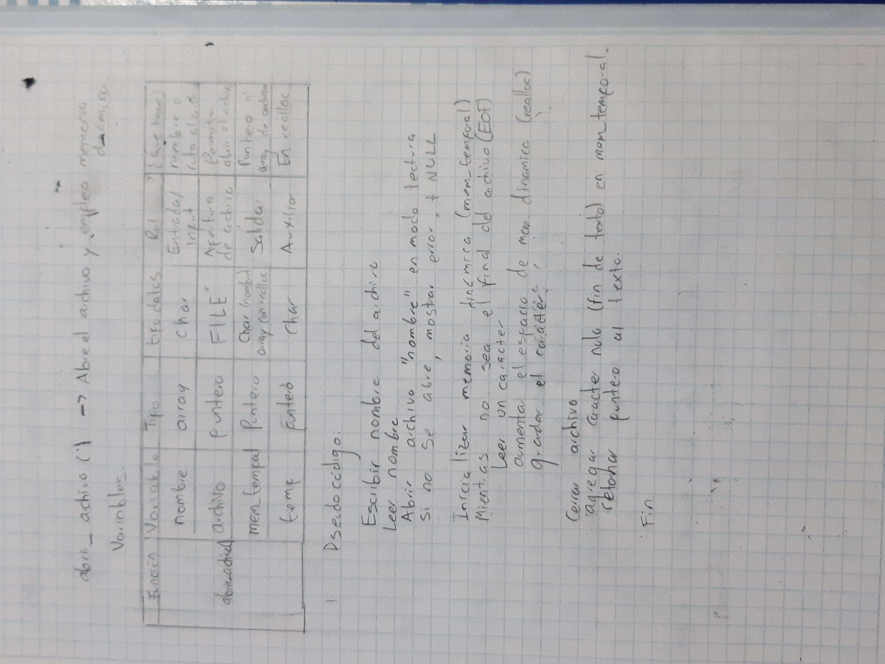

# Sustentación Unidad 4


- Por: Santiago Palacio Vargas
- ID: 00575805
----
## Explicación del análisis del problema:

- Generalmente cuando hay un problema, uno se suele preguntar: ¿alguien habrá tenido un problema parecido? ¿pudo llegar a una solución? Para el analisis general, fue más facil asosciar el reto con una herramienta ya existente, lo primero que se vino a la mente fue (Microsoft) Word. Pues se puede abrir un archivo de texto, buscar palabras, imprimir, contar letras, espacios y caracteres, entre otras cosas del reto. Ya que se sabe que hay algo parecido, entramos a mirar qué elementos nos pueden servir. 

- Lo primero, es la facilidad de abrir un archivo existente, modificarlo y guardarlo en uno nuevo. Pero se podría hacer más eficiente, en vez de seleccionar el archivo por medio de la interfaz de windows, el usuario solo escribiría el nombre.

- Luego, las tareas especiales: Word de ta una barra de opciones que se pueden usar repetitivamente a lo largo de la edición. Cada opción es una función, eso da la pista de trabajar con funciones, y la repetitividad nos indica un bucle.

- De esta forma, la situación pasó de ser un problema, a ser un referente de solución.


- NOTA: En honor a Microsoft Word, el archivo del reto se llama [word.c](word.c)


--- 

## Estrategia de solución:
- En el paso anterior, vimos que el problema evolucionó en pasos claros para seguir con el reto.

- Es claro que hay que utilizar funciones y blucles, la idea, es dejar la función principal lo más simple posible, y realizar funciones especificas para las tareas, así como en Word.

- Cada tarea especifica fue desarrollada como una función, sin embargo resultaron subrutinas que eran repetitivas en muchas funciones, entonces se separaron como funciones, que se reutilizan en todo el código.


Siendo estas las funciones


### `main(){}`


- Este es el centro de comando del programa, acá se llama a todas las funciones de acuerdo a las necesidades del usuario.

- La función main, en este caso, está compuesta de un bucle con un condicional basado en case. Existe una función que le pide al usuario un numero de opción acorde a la necesidad que presente, y con el valor que se retorna, en el main se selecciona el caso. Luego cada caso, segun la necesidad, llama a ejecución a una función que desempeña la tarea solicitada. Cuando el caso corresponde a salir, se suspende el bucle y se da las gracias.


### `menu(){}`

Prototipo: `int menu(void);`

- Acá le presentamos al usuario las opciones de las funciones disponibles, cada una asociada cn un número. El usuario ingresa el numero y le retornamos al main ese número para hacer el análisis al case. 

- Éstas son las opciones:


    1. Ver estadíscsticas
    2. Contar vocales
    3. Buscar y reemplazar
    4. Guardar en nuevo archivo
    5. Imprimir texto
    6. Salir
    


### `abrir_archivo(){}`

Prototipo: `char* abrir_archivo(void);`

- Permite abrir el archivo, y por medio de un puntero, gracias a la memoria dinámica, poder gestionar el contenido como un array dinámico.





### Explicación más detallada del proceso

- Primero declaramos archivo como puntero y utilizamos variables para calcular el tamaño de memoria a reservar.

```c
    char nombre[100];
    FILE *archivo;
    int tamano = 0;
    char *mem_temporal = NULL, *temp;
```


- Tomamos el nombre del archivo, o la ruta del archivo que nuestro usario seleccione.  Con la función auxiliar `recalcular_mem_temporal()`, podemos calcular el tamaño, para quitarle el enter a la entrada y reemplazarlo por el caracter nulo de las cadenas de texto. Utilizando así punteros y utilizar las funciones propias de la memoria dinámica.

- Posteriormente, una vez tenemos el nombre del archivo, por medio de la función prestablecida `fopen()`, ya tenemos el nombre como cadena de strings, y lo abrimos en modo lecutra de la forma: `archivo = fopen(nombre, "r");`

- Posteriormente con un While, recorremos todo el archivo, hasta encontrar el End Of File (EOF).

- A partir de este bucle, es posible calcular el tamaño de memoria a reservar. El puntero a la memoria temporal lo que le entregamos al main

- Nota: Se usa `realloc`, en vez de `malloc`, pues el archivo puede modificar su tamaño a lo largo de esta ejecucuión.


###  `recalcular_mem_temporal()`

Prototipo: `void recalcular_mem_temporal(char* mem_temporal, size_t tamano);`


- Esta función por medio de `strlen()` nos permite contar la cantidad de caracteres del texto ingresado, y posteriormente, cambiamos el caracter enter `'\n'` por el de caracter nulo `'\0'` para indicar el fin de la cadena de caracteres, así usamos el espacio preciso, sea para nombres, o en los requerimientos posteriores del programa.


### `estad_txt(){}`

Prototipo: `void estad_txt(char* texto, FILE* archivo);`

- Resumen: Con un while, cuenta caracter por caracter, y con condicionales identifica que tipo de caracter es para la cuenta. Se explica más detallado después del pseudocódigo:


- En `c` hay formas de identificar caracteres de espacio y salto de linea, lo que nos ayuda con las estadísticas.

- Para cada valor a contar se crea una variable con su nombre

- Con un while, que analiza caracter por caracter hasta que el carater sea \0, identificamos los carcteres bajo los siguientes criterios:

    - si no es slato de linea, cuenta como caracter.

    - Si es espacio, cuenta como caracter, y añade 1 al recuento de palabras, esto es posible gracias a la librería `<ctype.c>`, pues así como hay funciones que identifican caracteres como mayuscula o minúscula, también existe `isspace()` para los espacios.

- Usa `printf()` para imprimir en pantalla y `fprintf()` para añadirlos posteriormente al archivo nuevo si el usuario lo desea.


### `cont_voc(){}`


Prototipo: `void cont_voc(char* texto, FILE* archivo);`

- Cuenta las vocales en el texto.


- En un bucle hasta que el caracter sea '\0' se usa `tolower()` para volver todo minuscula, luego con condicionales identifica las vocales (a, e, i, o, u), y suma a cada contador.

-Usa `printf()` para imprimir en pantalla y `fprintf()` para añadirlos posteriormente al archivo nuevo si el usuario lo desea.


### `reemplazar(){}`

Prototipo: `void reemplazar(char** texto);`

- Cuando el usuario ingresa una palabra para buscar, y otra de reemplazo, el programa primero recorre el texto original. LUego contruye una nueva versión del mismo con los cambions hechos, y recalcula el tamaño. Es decir, si la palabra original tenía 5 letras, y la nueva 3, entonces recalcula con 2 letras menos en cada palabra reemplazada. Este programa se caracteriza por usar la memoria lo más justa posible, por eso se le presta tanta atención. Acá también se usa usamos `recalcular_mem_temporal()` por eso es una función auxiliar muy útil.

- Posteriormente se liberan las posiciones de memoria que ya no se piensan utilizar.


- El doble puntero juega un papel crucial. Pues, un puntero apunta a una dirección de memoria, entonces acabamos de crear una nueva dirección de memoria con los nuevos datos. Ahora necesitamos que la variable original contenga esos datos, como es un arreglo de datos, esta está denotada por un puntero.  El doble puntero hace que el puntero del array apunte a donde apunta este puntero, es decir, la nueva dirección de memoria de los datos nuevos. 


### `guardar_archivo(){}`


- Guarda los cambios y las estadísticas en un nuevo archivo.

Prototipo: `void guardar_archivo(char* texto)`;
`

- Como creamos un nuevo archivo, hay que preguntarle al usuario como quiere que se llame.

- Para esto usamos la misma estructura que abriendo el archivo porprimera vez, lo único que cambia es la forma de abrir el archivo, como en este caso queremos editar y no leer, ponemos el nombre del nevo archivo y lo abrumos como `archivo = fopen(nombre, "w");` que nos permite editarlo.

- Luego se escribe en el archivo vacío, desde el inicio, lo que está en la memoria temporal.


### `imprimir(){}`

- Imprime en pantalla el texto.

Prototipo: `void imprimir(char* texto);`


- Es la más simple de todas, solamente imprime la cadena de caracteres almacenada en la memoria temporal. 


### `cargando(){}`

Prototipo: `int menu(void);`

- Simula El tiempo de carga del programa.


- Se tiene un bucle `for()` de 1 a  100000. Luego la i se divide entre 1000, dando así como resultado los números del 1 al 100, pero el tiempo de procesamiento es mayor y alcanza a ser visible para el usuario. Con `'\r'` se permite reiniciar la linea del `printf()`, cada vez que se ejecuta, viene de el retorno de carro en las máquinas de escribir. 37 es el código ascii del signo de porcentaje (%).  

- Al final tenemos un programa estructurado que nos permite tener varias funciones para un archivo. 

### NOTA
- En los pseudocódigos no se puso inicio explicitamente, pero es claro donde inicia cada función.

- Si se quiere más detale en algunas funciones abrir [README.md](./README.md)

- De igual forma aunque en el .gitignore se excluyeron los .exe, siguen apareciendo.